## 阿里CTF比赛之AliCrackme逆向分析

先知：图片若看不了，请点击我去国内的码云查看：[https://gitee.com/qqizai/CrackApp](https://gitee.com/qqizai/CrackApp)

本文针对于新手，大佬的话，建议默默关掉窗口

想要了解最新动态，敬请关注[我的博客](https://blog.csdn.net/weixin_41173374)

### 本文将介绍两种方法：frida hook关键函数、so动态调试

文末有参考文献

#### 一、frida hook关键函数

update at 2020-11-22 12:00

首先介绍一下，我分析的思路，当接到一个任务需要逆向某APP，分析步骤如下：
- 1.首先体验一遍APP
- 2.体验之后，针对公司所给的需求/或者我们所需要的目标进行针对性的观察，再次体验一遍流程
- 3.抓包分析，提交的数据
- 4.APP是否防抓包、请求参数中是否需要特殊的加密
- 5.脱壳、反编译
- 6.针对关键词搜索代码，进而分析代码逻辑
- 7.找到加密逻辑之后，是否能够使用Python/Java/JS等语言能够实现还原的
- 8.若加密在so文件中，那么需要分析so文件里面的加密逻辑
- 9.这时候就考验真正的逆向技术了，不是开玩笑的 ----> 敬请欣赏一波搞笑视频：[一阵我放低你，就好嗨无面噶喔，唔系讲笑噶喔](https://www.bilibili.com/video/av668786650/)
- 10.使用IDA打开so文件分析
- 11.有必要的话，需要使用IDA进行动态调试
- 12.此时可能会遇到APP的反调试、so文件的反调试
- 13.这时候需要解决反调试才能进行后面的动态调试的分析

写此文章的时候，笔者认为第8步开始就是算难题，**需要给点耐心才能分析**

各位**打工人、干饭人**加油哟，未来可期！！！

##### 1.使用 jadx 反编译，发现没有壳，是可以正常反编译的，而且还没有混淆

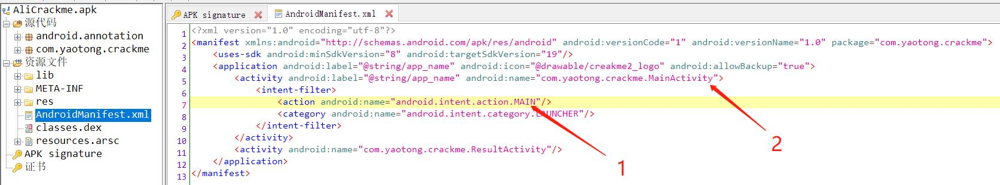
- 首先查看 AndroidManifest.xml，找到启动页加载的方法

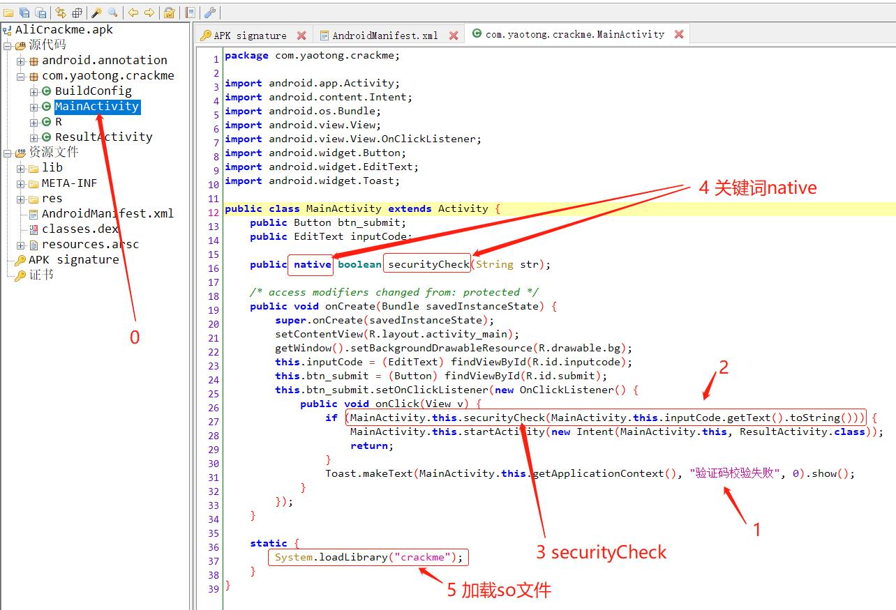
- 找到对应的源码，分析里面的逻辑
- 1首先引入眼帘的是：“验证码校验失败” 
- 2网上稍微看一下下，看到判断逻辑，若为true执行if里面的
- 3再细看，看到一个方法：securityCheck，如果我可以想方设法让这个校验一直为true，那么就达到了绕过的目的
- 4网上找这个 securityCheck 方法定义是在哪，发现是native加密
- 5找到加载 so 文件的地方
- System.loadLibrary("crackme")  

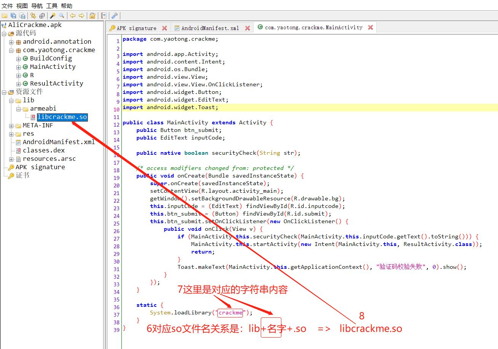
- 6直接去 lib 里面找到 so 文件
- 等于加载的so文件是： libcrackme.so  这个写法对应文件名关系就是：lib+加载的名字+.so  就是对应的 so 文件名

**到目前为止大概搞清楚了：其实这APP就是一个校验输入的密码是否跟APP内定的真正的密码完全一样，完全一样，那么就是直接进去对应的逻辑**

所以我们需要解决的问题就是：无论输入什么，都使这个if一直为true，这就达到我们的目的

开干吧！！！

**Just do IT!**

script.js:
```
//判断是否可用
if(Java.available){
    //frida固定写法Java.perform
    Java.perform(function(){
        //我们需要hook的类：MainActivity
        var MainActivity = Java.use("com.yaotong.crackme.MainActivity");
        
        //我们对这个securityCheck方法进行重新定义，无论输入什么都返回true
        MainActivity.securityCheck.implementation = function(args){
            var v = Java.androidVersion;
            send("version is " + v);
            send("received :" + args);
            send("hook successfully, NB!!");
            return true;
        };
    });
}
```

对应demo代码是：
```
#!/usr/bin/python3
# -*- coding: utf-8 -*-
# @Time     : 2020/11/13 0:22
# @Author   : qizai
# @File     : frida_hook.py
# @Software : PyCharm
import datetime
import sys

import frida


def on_message(message, data):
    if message["type"] == "send":
        print("[*] - {} {}".format(datetime.datetime.now().strftime("%Y-%m-%d %H:%M:%S.%f"), message["payload"]))
    else:
        print("[*] - {} message: {}".format(datetime.datetime.now().strftime("%Y-%m-%d %H:%M:%S.%f"), message))


def demo():
    """
    阿里官方的 demo——alicrackme
    用于学习 frida hook，主要是 hook 指定的函数，返回 true 即可绕过
    """
    app_name = "com.yaotong.crackme"
    jscode = open('script.js', 'r').read()
    process = frida.get_usb_device(timeout=10).attach(app_name)
    script = process.create_script(jscode)
    # 请注意，这个 "message" 是写死的，frida 里面是只能是这样写的
    script.on("message", on_message)
    print("[*] - {} Running CTF".format(datetime.datetime.now().strftime("%Y-%m-%d %H:%M:%S.%f")))
    script.load()
    sys.stdin.read()


if __name__ == "__main__":
    demo()
```

首先启动APP，然后再执行上面的程序，执行之后输出内容是：
```
[*] - 2020-11-22 12:06:55.850622 Running CTF
[*] - 2020-11-22 12:08:57.812562 version is 6.0
[*] - 2020-11-22 12:08:57.813559 received :我就问你谁
[*] - 2020-11-22 12:08:57.813559 hook successfully, NB!!
[*] - 2020-11-22 12:09:09.576112 version is 6.0
[*] - 2020-11-22 12:09:09.576112 received :我是qizai，感谢大家的阅读，一键三连走起
[*] - 2020-11-22 12:09:09.577110 hook successfully, NB!!
```

结果图：


#### 二、IDA动态调试so

**IDA快捷键：**
- 面板左侧函数列表可以查看每个函数的偏移量（相较于.so文件头的偏移量）
- F5键（windows fn+F5） ：把汇编代码转成C代码
- shift+F12 查看so文件中所有常量字符串的值 有的密码之类的可能就在这里面
- ctrl + s： 查看so文件段信息，双击可直接跳转进去查看代码
- G：输入跳转的地址，用于分析你需要分析的代码，打上断点，等待跳转进来
- F8：单步调试，一步一步执行
- 看到执行汇编代码最后一行的时候，看到哪条线一直在闪烁，那么下一步就是执行那里指向的代码
- 这中间，可以直接按F5来将汇编代码转换成C语言，同时也可以按F8进行单步调试
- 然后用鼠标可以看到v6是：aiyou,bucuoo
- 所以可以猜测，这个就是答案
- 可以直接拿去测试


- [x] 1、对 alicrackme apk 进行分析

分析到：native 加密
```
public native boolean securityCheck(String str);
```


- [x] 2、分析 so 文件

- 使用 IDA 打开
- 在左边里面进行搜索 Ctrl + F，输入：Java
- 可以看到搜索结果，有 Java 对应的方法 

```
Java_com_yaotong_crackme_MainActivity_securityCheck
```
- 双击这个方法，然后，按 F5 可以将汇编代码转换为 C 语言，这样更加好看代码的逻辑
- 然后这里部分逻辑，接上这里的操作：[IDA静态调试(静态分析)](http://note.youdao.com/noteshare?id=2556eb567da8a1d1fd549ce1075c37f4&sub=A9158BD8EEDB41F7BF0FC7B286C965E3)
- 然后使用 IDA 动态调试 so 文件


- [x] 首先检查APP是否可以进行调试的

```
λ adb shell dumpsys package com.yaotong.crackme                                                    Activity Resolver Table:
  Non-Data Actions:
      android.intent.action.MAIN:
        238903e com.yaotong.crackme/.MainActivity

Key Set Manager:
  [com.yaotong.crackme]
      Signing KeySets: 48

Packages:
  Package [com.yaotong.crackme] (bfc7e9f):
    userId=10154
    pkg=Package{7108bec com.yaotong.crackme}
    codePath=/data/app/com.yaotong.crackme-1
    resourcePath=/data/app/com.yaotong.crackme-1
    legacyNativeLibraryDir=/data/app/com.yaotong.crackme-1/lib
    primaryCpuAbi=armeabi
    secondaryCpuAbi=null
    versionCode=1 targetSdk=19
    versionName=1.0
    splits=[base]
    applicationInfo=ApplicationInfo{135abb5 com.yaotong.crackme}
    flags=[ DEBUGGABLE HAS_CODE ALLOW_CLEAR_USER_DATA ALLOW_BACKUP ]
    pkgFlagsEx=[ ]
    dataDir=/data/user/0/com.yaotong.crackme
    supportsScreens=[small, medium, large, xlarge, resizeable, anyDensity]
    timeStamp=2020-11-21 16:33:30
    firstInstallTime=2020-11-21 16:33:30
    lastUpdateTime=2020-11-21 16:33:30
    signatures=PackageSignatures{129724a [eb465bb]}
    installPermissionsFixed=true installStatus=1
    pkgFlags=[ DEBUGGABLE HAS_CODE ALLOW_CLEAR_USER_DATA ALLOW_BACKUP ]
    User 0:  installed=true hidden=false stopped=false notLaunched=false enabled=0
      runtime permissions:
    User 999:  installed=false hidden=false stopped=true notLaunched=true enabled=0
      runtime permissions:
```


- 其中最重要的是：flags 里面是否包含debugger权限字眼： DEBUGGABLE，有则可以进行调试
```
flags=[ DEBUGGABLE HAS_CODE ALLOW_CLEAR_USER_DATA ALLOW_BACKUP ]
```
- 如果没有的话，需要去改 APP 信息，然后重新打包

```
修改APP AndroidMenifest.xml文件， 
在 application 标签加上可调试权限  android:debuggable="true"
重新打包APP，签名，安装
```
- 以调试模式启动APP APP此时会挂住

```
adb shell am start -D -n 包名/.类名
adb shell am start -D -n com.yaotong.crackme/.MainActivity
```

- 需要先启动 android_server，具体文件是在 IDA 安装路径下的 dbgsrv 目录里面，需要根据你手机/模拟器的系统来将对于版本的 android_server push 到 /data/local/tmp 里面

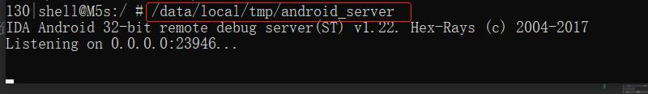

- 启动之后，然后去 IDA DebuggerOptions 里勾选 , (下面两个一定要勾选)
- [x] Suspend on process entry point
- [x] Suspend on thread start/exit
- [x] Suspend on library load/unload

IDA 连接不上的话，需要在 window/Linux 敲端口转发的命令：
```
adb forward tcp:23946 tcp:23946
``` 

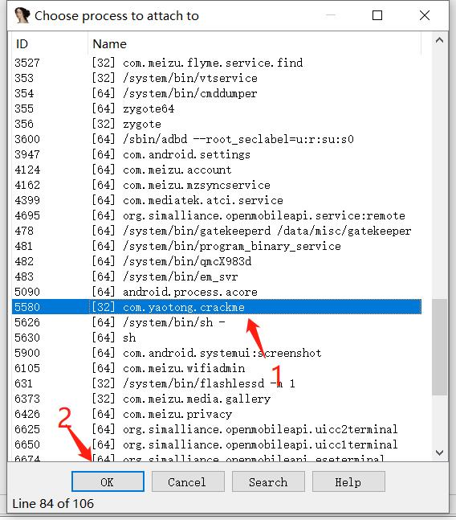


这样，JNI_OnLoad 函数是 lib 刚加载时就会执行，必须要在 lib 载入时就让程序停下来，才能调试 JNI_OnLoad

- 勾选之后，然后放行APP，点击 IDA 左上角那个绿色的三角运行按钮，放行
- 在设备里查看APP的进程ID

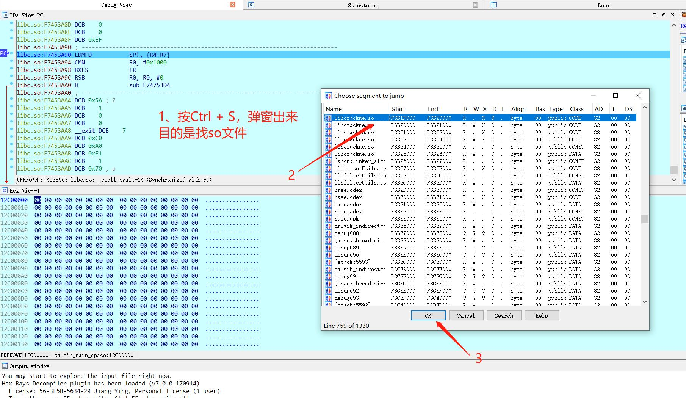

```
要adb shell先进入设备运行,且切换到root用户，如下命令，再过滤出该应用信息
adb shell
su
ps | grep 应用包名
ps | grep crackme
```
- 使用JDB命令让APP 恢复运行

```
adb forward tcp:8700 jdwp:873（APP的PID）
jdb -connect com.sun.jdi.SocketAttach:hostname=127.0.0.1,port=8700
```
- 在so文件被加载时，IDA会停止住，使用ctrl+s 查看目标so文件是否加载
- 若加载点选目标so文件，这里我们选择libcrackme.so，双击这个文件
- 然后计算 JNI_OnLoad 的绝对地址，将刚刚跳转过来的 so 文件开头的地址 + 加上我们需要调试的函数的偏移地址，注意是16进制的
- 按G键，然后输入相加之后的地址，记得这个地址中间是没有空格的
- 回车，跳转到 JNI_OnLoad 处
- 设置断点，恢复APP执行
- 找到反调试代码处，pthread_create()


**如何找到反调试代码处？（关键地方，可按f5，把汇编代码转成C语言辅助）**

- 反复按F8单步执行，程序退出处（前面），即为反调试处
- 如何让反调试代码不执行？
- 让该指令变为空指令，既 NOP，NOP指令的16进制是 00 00 00 00
- 记住反调试处的汇编指令，同时以静态方式再打开一个IDA（也叫双开IDA 以动态和静态方式各打开一个IDA ），
- 打开so文件，在静态ida里查找到此汇编指令，鼠标选中后面寄存器，然后切换到Hex View，会显示该指令的16进制，
- 复制该16进制，再用一文本工具打开目标so文件，找到该16进制处，替换成 00 00 00 00 ，即空指令。
- 即不执行反调试代码。
- 保存so文件，再重新打包APP，签名，重新安装APP。


**重新打包之后，那么就可以不用上面命令行启动APP的方式来调试了，可以直接使用 IDA 的 attach 方式来调试(需要先启动APP)，然后后面分析的步骤是一样的**


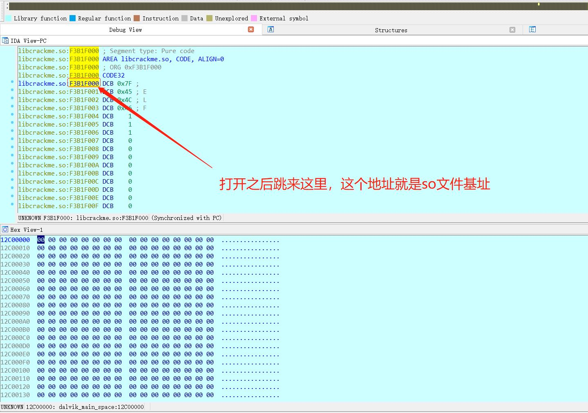

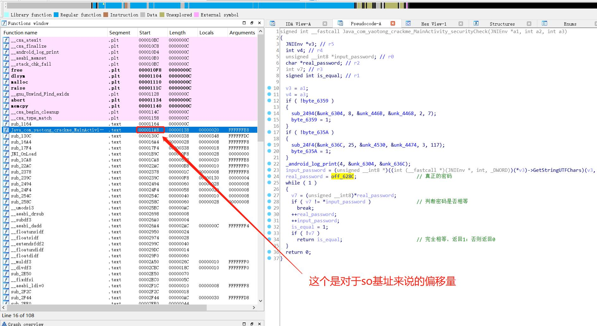

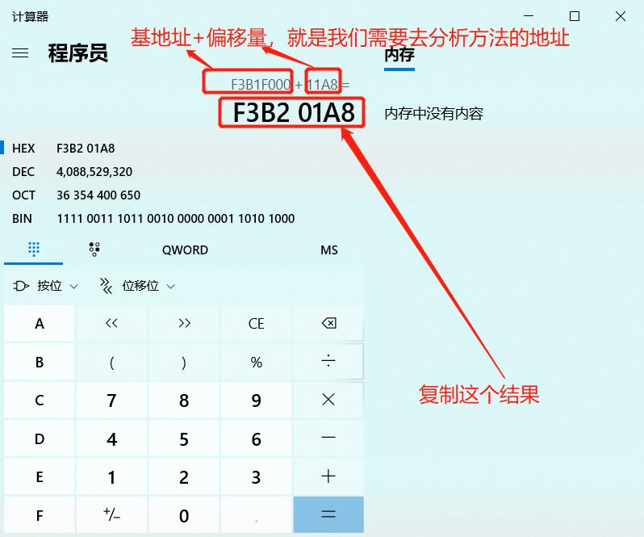

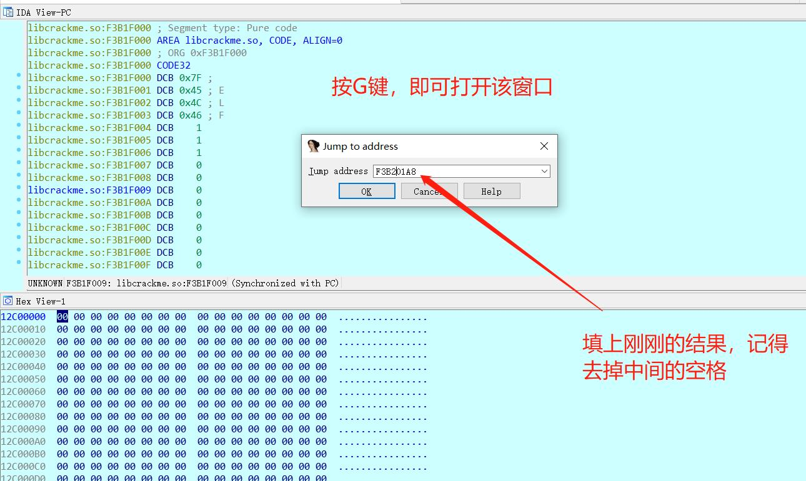

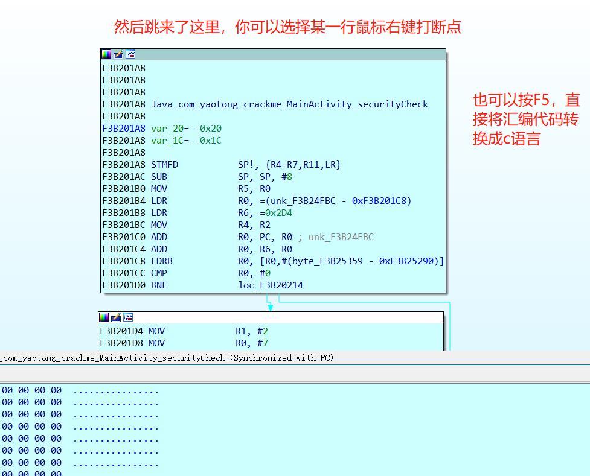

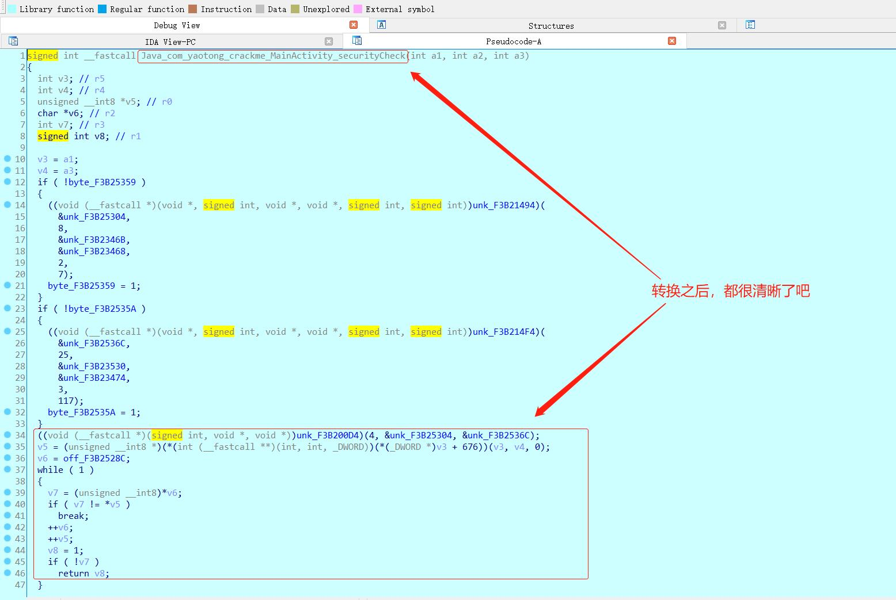


#### 三、frida hook native，直接获取答案

既然我们都找到了答案那个字符串在哪里了，那么可以直接使用 so基址+偏移量，可以读取那个字符串常量的内容，所得就是我们的答案

对应 frida api 是：
- Module.findBaseAddress(so文件名)：读取so基址/返回模块的基址
- Memory.readPointer(地址)：从此内存位置读取NativePointer
- Memory.readUtf8String(pointer)：以UTF-8的形式读取此内存位置的字节

```
if(Java.available){
    Java.perform(function(){
        //法2：直接是获取so基址加上偏移量，直接读取真正的答案,具体请看截图：alicrackme04.jpg
        var so_addr = Module.findBaseAddress("libcrackme.so");
        send("real pwd: " + Memory.readUtf8String(Memory.readPointer(so_addr.add(0x628c))));
    });
}
```
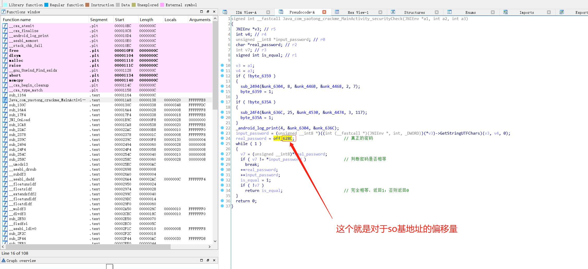


#### 三、本文小结知识点

- frida hook java 层函数
- frida hook native 层函数
- IDA 动态调试 so 文件
- 如何解决 apk 反调试
- 如何解决 so 文件反调试


##### 额外建议

- 新手有时间的话，建议直接手动操作一波

附件: AliCrackme.apk

```
链接: https://pan.baidu.com/s/1HEi3OMevTnTAWMxMZ8CaqA 
提取码: sas5 复制这段内容后打开百度网盘手机App，操作更方便哦
```

参考资料：
- [Frida 官方文档](https://frida.re/docs/home/)
- [FRIDA-API使用篇——肉丝](https://www.anquanke.com/post/id/195869)
- [r0ysue Github](https://github.com/r0ysue/AndroidSecurityStudy)
- [r0ysue 看雪](https://bbs.pediy.com/user-home-581423.htm)

r0ysue肉丝是我目前见过最牛逼的逆向真男人


##### 赞赏

如果你觉得笔者辛苦了，可以的话请我喝杯咖啡，感谢你的支持


你的赞赏就是我的动力